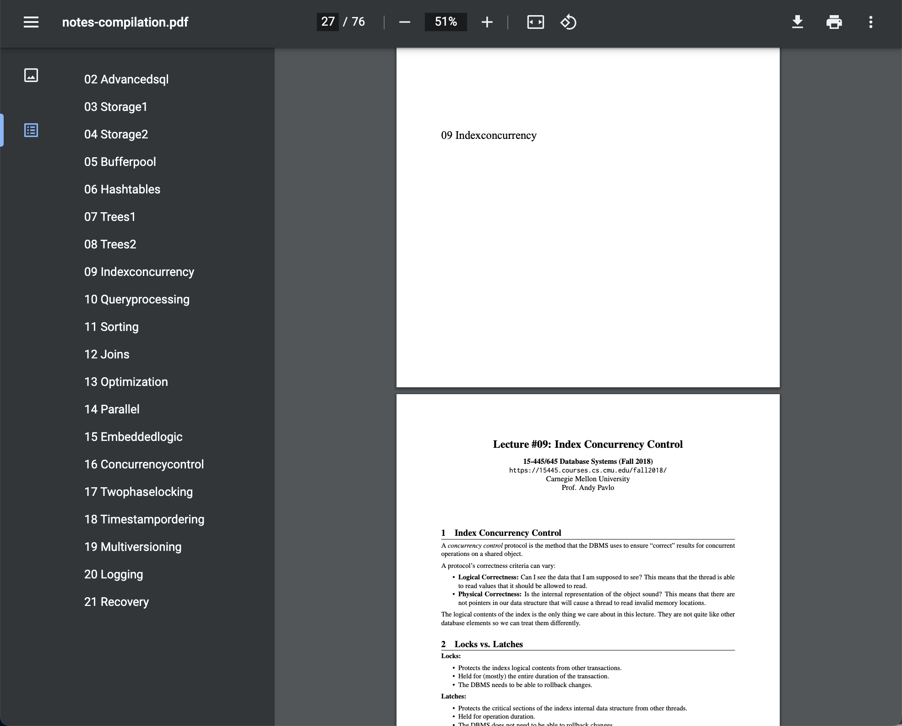

# pdf merger

- Automatically add title page and TOC(table of contents) from file name
- Dependencies: `PyPDF2, reportlab`



## Usage

```
pip install -r requirements.txt
python main.py ./your-pdfs
```

## Tutorial

- My pdfs saved in a folder.

```
./notes
├── 02-advancedsql.pdf
├── 03-storage1.pdf
├── 04-storage2.pdf
├── 05-bufferpool.pdf
├── 06-hashtables.pdf
├── 07-trees1.pdf
├── 08-trees2.pdf
├── 09-indexconcurrency.pdf
├── 10-queryprocessing.pdf
├── 11-sorting.pdf
├── 12-joins.pdf
├── 13-optimization.pdf
├── 14-parallel.pdf
├── 15-embeddedlogic.pdf
├── 16-concurrencycontrol.pdf
├── 17-twophaselocking.pdf
├── 18-timestampordering.pdf
├── 19-multiversioning.pdf
├── 20-logging.pdf
└── 21-recovery.pdf

0 directories, 20 files
```

- Run program

```
❯ python main.py ./notes
Try to process: notes
Read: notes/02-advancedsql.pdf 02 Advancedsql
Read: notes/03-storage1.pdf 03 Storage1
Read: notes/04-storage2.pdf 04 Storage2
...<truncated>...
```

- Nice!

```
❯ l notes-compilation.pdf
-rw-r--r--  1 me  me  1.7M Jan 19 15:11 notes-compilation.pdf
```
